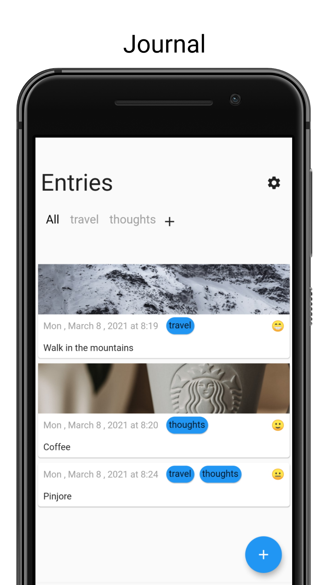

 

Open Source Journaling App with Calender, Map View and stats. 

    <!-- 
     -->
    

 

    
    

 
    
    
     
    

# Features:

* journal entry with mood, location and image.
* Map View
* Calendar View
* stats
* fingerprint lock
* tags

# Have Suggetions ?

You can add an issue [here](https://github.com/abhinavmarwaha/wrotto-app/issues) or fill up a google form [here](https://docs.google.com/forms/d/e/1FAIpQLSfiGhbdZuLbXUQznlL8Ss3AcJhX50SXsdrNIcrB7CieILm-1w/viewform?usp=sf_link).

You can contact me at heyabhinav@protonmail.com

# Todo

[Roadmap](https://github.com/abhinavmarwaha/wrotto-app/projects/1).
